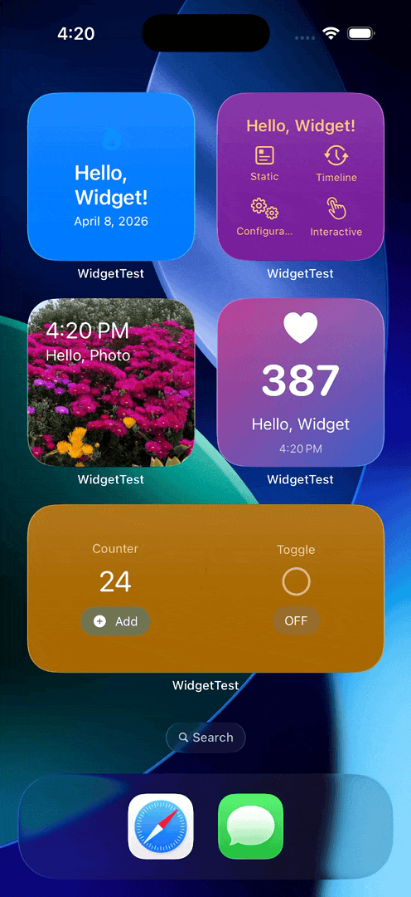

# WidgetTest

A SwiftUI sample app demonstrating the full range of WidgetKit capabilities on iOS.

## Screenshots



## Features

### 1. Static Widget
Basic `StaticConfiguration` widget that displays user-customizable text, icons, and colors. Data is shared between the app and widget via an App Group using `UserDefaults`.

### 2. Timeline Widget
Demonstrates `TimelineProvider` with scheduled entries. The widget creates multiple future timeline entries and automatically refreshes at each interval, showing the current time and update count.

### 3. Configurable Widget
Uses `AppIntentConfiguration` with the App Intents framework. Users can configure display style (Minimal / Standard / Detailed), toggle date visibility, and select an accent color directly from the widget's edit screen.

### 4. Interactive Widget
Demonstrates interactive controls inside widgets using `Button(intent:)` and `Toggle(isOn:intent:)`. A counter can be incremented and a toggle can be flipped without launching the app, powered by `AppIntent` actions.

### 5. Deep Link Widget
Uses `widgetURL` and `Link` to navigate to specific screens in the app. Tapping different areas of the widget opens different feature detail views via a custom URL scheme (`widgettest://`).

### 6. Lock Screen Widget
Supports all three accessory widget families for the Lock Screen and StandBy mode:
- **Accessory Circular** — icon with short label
- **Accessory Rectangular** — icon with title and subtitle
- **Accessory Inline** — single-line text with icon

### 7. Animated Widget
Demonstrates `contentTransition(.numericText())` for animating between timeline entries. The background uses a dynamic gradient derived from the displayed value — each number produces a unique, deterministic color pair that transitions smoothly.

### 8. Photo Widget
Select a photo from your library to display as the widget background with a live time and title overlay. The photo is compressed to fit widget archival limits and shared via the App Group container.

## Architecture

| Layer | Description |
|-------|-------------|
| **Models** | `WidgetFeature`, `WidgetAppearance`, `WidgetFamilyOption`, `WidgetDisplayStyle` |
| **ViewModels** | `WidgetFeatureDetailViewModel` (`@Observable`, `@MainActor`) |
| **Views** | Feature list, detail view with live preview, widget size picker, appearance controls |
| **Shared** | Content views reused by both the app preview and widget extension |
| **Widget Extension** | 8 widgets with their own providers, entries, and configurations |

### Data Flow

```
App (WidgetFeatureDetailView)
  --> WidgetDataStore (UserDefaults via App Group)
    --> WidgetCenter.shared.reloadTimelines(ofKind:)
      --> Widget Extension (TimelineProvider reads from same App Group)
```

## Key Technologies

- **SwiftUI** with `@Observable` and `@Bindable`
- **WidgetKit** — `StaticConfiguration`, `AppIntentConfiguration`, `TimelineProvider`
- **App Intents** — `WidgetConfigurationIntent`, `AppIntent` for interactive widgets
- **PhotosPicker** — photo selection and compression for widget display
- **App Groups** — shared `UserDefaults` and file container between app and extension
- **Deep Linking** — custom URL scheme handling via `onOpenURL`

## Requirements

- iOS 17.0+
- Xcode 16+
- Swift 6

## Build & Test

```bash
# Build
xcodebuild -project WidgetTest.xcodeproj -scheme WidgetTest -sdk iphonesimulator build

# Run unit tests
xcodebuild -project WidgetTest.xcodeproj -scheme WidgetTest -sdk iphonesimulator test
```

## Project Structure

```
WidgetTest/
  WidgetTestApp.swift          # App entry point
  ContentView.swift            # Root view with deep link handling
  Models/                      # Data models
  ViewModels/                  # Observable view models
  Views/                       # App screens
  Shared/                      # Content views shared with widget extension
  Extensions/                  # Color+Hex utilities

WidgetTestWidget/
  WidgetTestWidgetBundle.swift  # Widget bundle entry point
  Widgets/                      # Individual widget implementations
```
